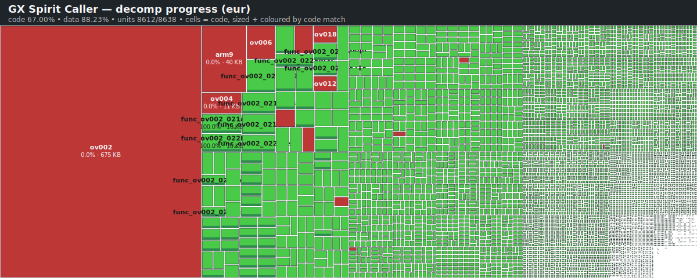
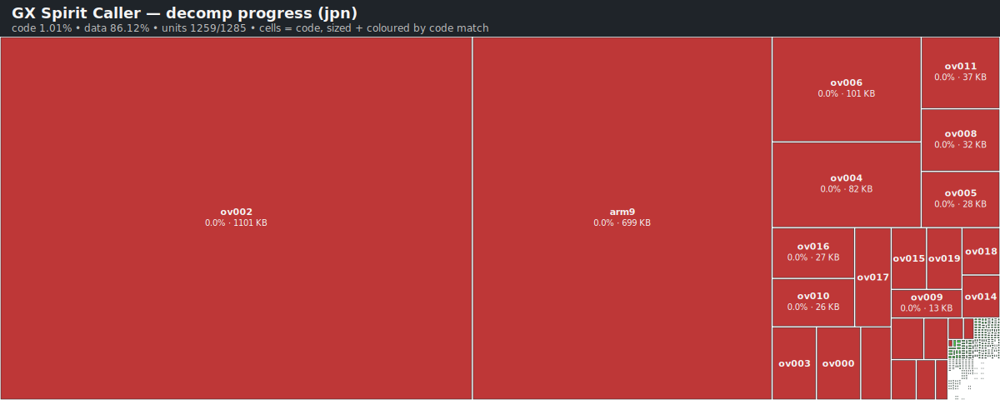

<p align="center">
  
</p>

<h1 align="center">GX Spirit Caller Decomp</h1>

<p align="center">
  
  
  
</p>

<p align="center">
  <strong>🎉 Byte-identical ROM rebuild: EUR + USA + JPN</strong><br>
  
  
</p>

<p align="center">
  <strong>Per-region code-tier progress</strong><br>
  
  
  
</p>

<p align="center">
  A matching decompilation of <em>Yu-Gi-Oh! GX Spirit Caller</em> for the Nintendo DS.
  The goal is a byte-identical ROM rebuilt from clean C source — every function, every
  overlay, every padding byte. Driven by <a href="https://github.com/AetiasHax/ds-decomp"><code>dsd</code></a>
  with an <code>mwccarm</code>/<code>mwldarm</code> toolchain and an <code>objdiff</code>
  feedback loop.
</p>

## The Goal

- **Byte-identical rebuild** of the retail ROM — the SHA-1 of `ninja`'s output must match the SHA-1 of the original dump.
- **Multi-region from day one** — `usa` (AYXE), `eur` (AYXP), `jpn` (AYXJ). Pick one per build; they coexist in `config/<ver>/` and `extract/<ver>/`.
- **Readable C source** — no hand-written assembly beyond what the compiler produces. Symbol names match in-game concepts as we uncover them.
- **Reproducible on any host** — one `ninja` invocation pulls the toolchain, extracts the ROM, delinks every object, and compares the rebuild against the expected hash.

## Quick Start

You supply your own clean dump — this repo never ships copyrighted binaries.

### macOS (Apple Silicon or Intel)

```bash
# 1. One-time: install native prerequisites
brew install ninja
brew install --cask wine-stable          # runs the Win32 mwcc/mwld toolchain

# 2. Drop your dump in orig/ and clone the repo
cp ~/Downloads/my-eur-dump.nds orig/baserom_eur.nds

# 3. Python deps in a venv
python3 -m venv .venv && source .venv/bin/activate
pip install -r tools/requirements.txt

# 4. Generate build.ninja (verifies the baserom SHA-1 at configure time)
python tools/configure.py eur            # or usa / jpn once those are wired

# 5. Round-trip build and verify
ninja sha1
```

### Linux

```bash
sudo apt install ninja-build python3-venv           # or your distro's equivalent
python3 -m venv .venv && source .venv/bin/activate
pip install -r tools/requirements.txt
cp ~/my-dump.nds orig/baserom_eur.nds
python tools/configure.py eur
ninja sha1                                          # wibo is auto-downloaded
```

### Windows

```powershell
winget install Kitware.Ninja                        # or use chocolatey / scoop
python -m venv .venv; .\.venv\Scripts\Activate.ps1
pip install -r tools/requirements.txt
copy C:\Users\me\my-dump.nds orig\baserom_eur.nds
python tools\configure.py eur
ninja sha1                                          # mwcc runs natively
```

If the SHA-1 check fails at configure time, the error message tells you exactly
which hash to paste where. **Do not bypass the check** — a wrong dump will
silently waste hours of analysis.

## The Matching Workflow

```
  +-------------+     dsd rom         +------------+     dsd init      +-----------+
  | orig/*.nds  |  ----extract---->   | extract/   |  --------------> | config/   |
  +-------------+                     +------------+                   +-----------+
                                            |                                |
                                            | dsd delink                     |
                                            v                                |
                                      +------------+                         |
                                      |  .o files  |                         |
                                      +------------+                         |
                                            |                                |
                                src/*.c ----+                                |
                                libs/*.c ---+                                |
                                            |                                |
                                   mwccarm compile                           |
                                            |                                |
                                            v                                |
                                      mwldarm link                           |
                                            |                                |
                                            v                                |
                                      +-------------+    dsd rom       +-----+------+
                                      |  arm9.o     |  ----build-->   |  built .nds |
                                      +-------------+                  +------------+
                                                                              |
                                                                              v
                                                                        sha1 == baserom?
```

Typical inner loop once decomp is under way:

1. Pick an unmatched function from `config/<ver>/**/symbols.txt`.
2. Write a C version in `src/…` (or `libs/…` for SDK code).
3. `ninja` rebuilds; `ninja objdiff` generates a per-function diff.
4. `ninja report` aggregates into `build/<ver>/report.json`; `python tools/progress.py` prints a table.
5. Rename the symbol in `symbols.txt` from `func_02001234` to its real name once it matches.

## Project Layout

```
.
├── orig/                # user-supplied baseroms (gitignored)
├── extract/             # dsd rom extract output (gitignored)
├── config/<ver>/        # dsd init output: delinks, relocs, symbols
├── src/                 # decompiled game code (C/C++, empty at 0%)
├── include/             # shared headers
├── libs/                # SDK / third-party libraries
├── tools/
│   ├── configure.py     # generates build.ninja
│   ├── progress.py      # prints % matched
│   └── ...              # small helpers + vendored ninja_syntax
├── build/               # ninja output (gitignored)
├── CLAUDE.md            # conventions & workflow for AI collaborators
└── README.md
```

See [CLAUDE.md](CLAUDE.md) for the full toolchain table, conventions, and
tracked placeholders.

## Progress

Each region builds independently; the per-region heatmaps below
visualise structural coverage (one rectangle per translation
unit; area proportional to code + data bytes; fill color encodes
match percentage from red 0% through orange/yellow to green
100%). Hover any cell on a desktop browser for the exact name,
size, and percentage.

### EUR (`AYXP`)

<p align="center">
  
</p>

### USA (`AYXE`)

<p align="center">
  
</p>

### JPN (`AYXJ`)

<p align="center">
  
</p>

```bash
python tools/progress.py --version eur    # human-readable table per region
ninja heatmap                             # regenerates assets/progress-heatmap-<region>.svg
                                          # for whichever region was configured
```

`progress.py` reads `build/<ver>/report.json` once `ninja report` has run.
Before that, it falls back to counting `function` entries in every
`symbols.txt` so the denominator is non-zero from day one.

The heatmap SVGs are committed to the repo so they render on GitHub.
To regenerate all three after a change that affects matched %:

```bash
for v in eur usa jpn; do
    python tools/configure.py "$v" && ninja heatmap
done
```

Commit the updated SVGs alongside your code change so the README stays
current.

## Toolchain

| Tool          | Version      | Notes                                                       |
|---------------|--------------|-------------------------------------------------------------|
| `mwccarm`     | `2.0/sp1p5`  | decomp.me id: `mwcc_30_131`                                 |
| `mwldarm`     | `2.0/sp1p5`  | ships alongside `mwccarm`                                   |
| `dsd`         | `v0.11.0`    | native macOS arm64 + Linux x86_64 + Windows builds          |
| `objdiff-cli` | `v2.7.1`     | macOS/Linux/Windows, x86_64 and arm64                       |
| `wibo`        | `0.6.16`     | Linux-only PE loader for the Win32 toolchain                |
| `wine`        | stable       | macOS equivalent of `wibo`; install via Homebrew            |
| `ninja`       | any recent   | build driver                                                |
| Python        | 3.11+        | match-statements & PEP 604 unions                           |

Everything except `ninja`, `python`, `wine`, and the baserom is downloaded
automatically the first time you run `ninja`.

## Contributing

Contributions are very welcome — this is the kind of project that benefits
from lots of small, careful PRs. Start with:

- A single unmatched function in any overlay. Small wins compound.
- Better symbol names (`func_020b3a7c` → `DuelState_ShuffleDeck`, etc.).
- Tooling fixes — anything in `tools/` that breaks on your platform.

Open an issue first if you're planning a structural change (new overlay
layout, new helper script, toolchain version bump).

## Credits

- [ds-decomp](https://github.com/AetiasHax/ds-decomp) by Aetias — the toolchain this project is built around.
- [dqix](https://github.com/StanHash/dqix) by StanHash — primary template for the `configure.py` and repo shape.
- [objdiff](https://github.com/encounter/objdiff) by LagoLunatic / encounter — per-function diffing.
- [wibo](https://github.com/decompals/wibo) by the decompals community — lightweight PE loader for Linux.
- Konami — for the game. This project is for educational and research purposes; we don't ship ROMs.

Licensed under the [MIT License](LICENSE).
